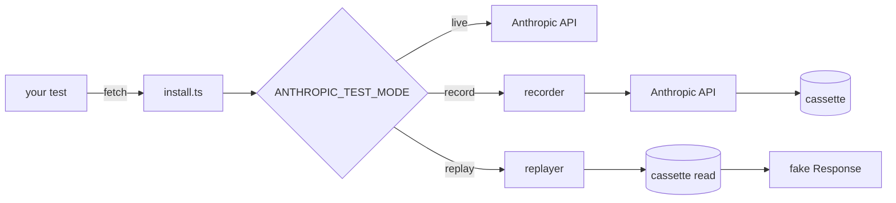

# ai-app-integration-tests
> End-to-end test patterns for LLM features in Next.js: deterministic API replay, Playwright streaming tests, flake-reduction, sub-5-minute CI.


## What this is

A small TypeScript toolkit for testing AI features in Next.js apps
without flaking on the API. The first piece, shipped here, is a
**deterministic Anthropic API replay layer**: a recorder captures real
API responses to per-request cassette files; a replayer serves them
back byte-for-byte in tests. The interception happens at Node's global
`fetch`, so any caller using `@anthropic-ai/sdk` (or raw `fetch` to
`api.anthropic.com`) is captured without touching application code.

The toolkit is opinionated about three things. First, **redaction is
mandatory and runs before write** — the recorder refuses to commit a
cassette that still contains anything matching an API-key or Bearer-token
shape, and a CI job re-checks every committed cassette so a future leak
fails the build. Second, **missing cassette = loud failure** — in
replay mode, the absence of a cassette throws with the request hash so
the operator knows exactly what to re-record (silent fall-through to
live is forbidden). Third, **mode is environment-driven** —
`ANTHROPIC_TEST_MODE` is `record | replay | live`, defaulting to
`replay` so CI never accidentally hits the real API.

This PR (issue #1) ships the toolkit and a demo test that runs against
a committed Anthropic-shaped cassette. Subsequent issues (#2 Playwright
streaming tests, #4 example app under test) build on this layer.

## Architecture

See [`docs/architecture.md`](docs/architecture.md) for the full
breakdown. Quick diagram:



## Quickstart

```bash
npm install
npm run lint && npm run typecheck && npm test && npm run build
# 24 tests pass — fully hermetic, no API key needed
```

In your own test setup:

```ts
import { afterAll, beforeAll } from "vitest";
import { installFromEnv, uninstall } from "ai-app-integration-tests";

beforeAll(() => installFromEnv({ fixturesDir: "./fixtures" }));
afterAll(() => uninstall());
```

Then run your tests:

```bash
# Default: replay mode. No API key needed; missing cassette throws.
npm test

# Re-record cassettes. Real API calls. Costs real money.
ANTHROPIC_TEST_MODE=record ANTHROPIC_API_KEY=sk-... npm test

# Pass-through to the real API (no recording, no replay).
ANTHROPIC_TEST_MODE=live ANTHROPIC_API_KEY=sk-... npm test
```

## Benchmarks / Results

The relevant metric for this layer is "tests stay green and fast" —
24 tests run in ~325ms locally with zero network access. Once the
example app + Playwright tests land in #2/#4, the benchmark becomes
total CI run time on `ubuntu-latest` (target: <5 minutes per the §2
spec).

## Demo

`test/demo.test.ts` exercises the full install→fetch→replay flow against
a committed Anthropic `/v1/messages` cassette. 60-second video demo
pending the example app (#4).

## Why these decisions

See [`MEMORY/core_decisions_human.md`](MEMORY/core_decisions_human.md). Notable:

- **D-002.** Fetch monkey-patch, not MSW. One provider, ~300 lines is
  cheaper than the MSW dep + worker-vs-node split.
- **D-003.** Cassette key = stable hash over `{method, url, normalized-body}`.
  Headers excluded (vary across runs).
- **D-004.** Redaction is mandatory and runs before write. CI also
  rescans every committed cassette.
- **D-005.** Missing cassette in replay mode throws. Silent fall-through
  to live is forbidden — it hides credential leaks and stale tests.

## License

MIT
