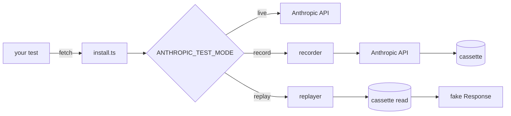

# ai-app-integration-tests
> End-to-end test patterns for LLM features in Next.js: deterministic API replay, Playwright streaming tests, flake-reduction, sub-5-minute CI.


> **CI wall-time target:** < 5 min on warm-cache runs (#5). The workflow caches npm, Next.js builds, and Playwright browsers; each job emits a duration line into the run's Summary tab. Cache strategy: [`docs/ci-timing.md`](docs/ci-timing.md).

## What this is

A small TypeScript toolkit for testing AI features in Next.js apps
without flaking on the API. The first piece, shipped here, is a
**deterministic Anthropic API replay layer**: a recorder captures real
API responses to per-request cassette files; a replayer serves them
back byte-for-byte in tests. The interception happens at Node's global
`fetch`, so any caller using `@anthropic-ai/sdk` (or raw `fetch` to
`api.anthropic.com`) is captured without touching application code.

The toolkit is opinionated about three things. First, **redaction is
mandatory and runs before write** — the recorder refuses to commit a
cassette that still contains anything matching an API-key or Bearer-token
shape, and a CI job re-checks every committed cassette so a future leak
fails the build. Second, **missing cassette = loud failure** — in
replay mode, the absence of a cassette throws with the request hash so
the operator knows exactly what to re-record (silent fall-through to
live is forbidden). Third, **mode is environment-driven** —
`ANTHROPIC_TEST_MODE` is `record | replay | live`, defaulting to
`replay` so CI never accidentally hits the real API.

All five feature issues (#1–#5) have shipped: the toolkit + cassette
replay (#1), Playwright streaming tests (#2), flake-reduction helpers
(#3), the example Next.js app (#4), and the sub-5-minute CI workflow
(#5). The **example Next.js app** under `example-app/` has three
screens (streaming, tool use, error path), runnable with
`npm run example:dev`. Playwright tests drive those screens through
deterministic UI states (see the "Playwright tests for streaming UI"
section below); the flake-reduction helpers under `src/support/` cover
retry budgets, time-bounded waits, and semantic equality.

## Architecture

See [`docs/architecture.md`](docs/architecture.md) for the full
breakdown. Quick diagram:



## Quickstart

```bash
npm install
npm run lint && npm run typecheck && npm test && npm run build
# full hermetic vitest suite passes — no API key needed
```

In your own test setup:

```ts
import { afterAll, beforeAll } from "vitest";
import { installFromEnv, uninstall } from "ai-app-integration-tests";

beforeAll(() => installFromEnv({ fixturesDir: "./fixtures" }));
afterAll(() => uninstall());
```

Then run your tests:

```bash
# Default: replay mode. No API key needed; missing cassette throws.
npm test

# Re-record cassettes. Real API calls. Costs real money.
ANTHROPIC_TEST_MODE=record ANTHROPIC_API_KEY=sk-... npm test

# Pass-through to the real API (no recording, no replay).
ANTHROPIC_TEST_MODE=live ANTHROPIC_API_KEY=sk-... npm test
```

### Playwright tests for streaming UI (#2)

`example-app/e2e/streaming.spec.ts` drives the example app's
`/streaming` page through three deterministic UI states using
`@playwright/test`:

1. **short stream** — prompt contains "short" → `idle → loading → first-token → done` in ≤ 1 s.
2. **long stream** — 32 chunks ~12 ms apart → `idle → loading → first-token → streaming → done`; asserted text landmarks across the stream.
3. **error stream** — prompt contains "error" → `idle → loading → error`; error card visible.

A Next.js `instrumentation.ts` hook installs a deterministic
Anthropic-API stub (`example-app/instrumentation-stub.ts`) when the
server boots with `ANTHROPIC_TEST_MODE=replay`. The stub intercepts
`globalThis.fetch` calls to `api.anthropic.com` and routes the request
to a canned SSE stream based on a keyword in the user prompt — no API
key, no network. Production behavior is unchanged when the env var is
unset.

Local run (after `npm install --prefix example-app && npx --prefix example-app playwright install chromium`):

```bash
npm run test:e2e --prefix example-app
# 3 passed in ~5 s
```

The `playwright` CI job caches the Chromium download keyed on the
Playwright package version, so post-cache runs are dominated by the
Next.js build, not the browser install.

### Flake-reduction patterns (#3)

Three small helpers under `src/support/` cover the test-runtime
failure modes that come up when AI features hit non-deterministic
surfaces:

- **`withRetryBudget(fn, policy)`** — bounded retries with a
  classifier callback so flaky errors retry but real bugs throw
  immediately. The default classifier treats network families +
  429 + 5xx as flake.
- **`waitFor(predicate, options)`** — time-bounded predicate
  polling with a documented label and the last-value attached to
  the timeout error.
- **`expectSemanticallySimilar(actual, expected, opts)`** — Jaccard
  similarity over normalized tokens with a tunable threshold, for
  AI-text assertions that survive minor wording drift.

All three are dep-free, both `sleep` and `now` are pluggable for
synchronous unit tests, and the three compose cleanly — see
[`docs/patterns.md`](docs/patterns.md) for the per-helper writeups
and `test/demo-flake-patterns.test.ts` for the executable
composition example.

```typescript
import { expectSemanticallySimilar, waitFor, withRetryBudget } from "ai-app-integration-tests";

const response = await withRetryBudget(() => callLLM(), { maxAttempts: 3, backoffMs: 200 });
expectSemanticallySimilar(response, expectedAnswer, { threshold: 0.4 });
const surfaced = await waitFor(() => readUiResponse(), { timeoutMs: 5000, intervalMs: 100, label: "ui-response" });
```

## Benchmarks / Results

The relevant metric for this layer is "tests stay green and fast" —
49 vitest tests run in ~340 ms locally with zero network access; the
3 Playwright streaming tests run in ~5 s (CI target: <60 s per the
issue acceptance criteria, comfortably met).

## Demo

```bash
bash scripts/capture_demo.sh
```

The capture script ([#12], D-011, `scripts/capture_demo.sh`) drives
three surfaces end-to-end on a fresh clone with no API key. (1)
`npx vitest run test/demo.test.ts test/record-replay.test.ts` —
exercises the install-from-env + cassette replay flow (D-002, D-003)
plus the record→replay round-trip. The two test files are passed by
path so this surface doesn't recurse with the smoke test that drives
the script itself. (2) An inline tsx helper
(`scripts/missing_cassette_demo.ts`) installs the replayer against an
empty fixtures dir and fetches `/v1/messages` — D-005 makes that
fatal, and the script prints the actual `MissingCassetteError` text
so a viewer sees the guarantee enforced, not just claimed. (3)
`npm run test:e2e --prefix example-app` runs the Playwright streaming
suite from `example-app/e2e/streaming.spec.ts` against the
deterministic Anthropic stub installed by
`example-app/instrumentation-stub.ts` via `instrumentation.ts` (D-008).
Surface 3 auto-skips with a clear banner when Playwright's chromium
isn't installed locally, so the same script runs in the `toolkit` CI
job (via `test/capture-demo-smoke.test.ts`) without needing browsers.

Run the full three-surface tour for a recording with
`npx --prefix example-app playwright install chromium` first.
The actual binary commit (`docs/demo.{webm,mp4,gif}` + README embed)
is split into a follow-up — see [#16] — because that's a 30-min
operational step gated on local browsers + ffmpeg, separate from
the engineering that makes the recording reproducible.

[#12]: https://github.com/jt-mchorse/ai-app-integration-tests/issues/12
[#16]: https://github.com/jt-mchorse/ai-app-integration-tests/issues/16

## Why these decisions

See [`MEMORY/core_decisions_human.md`](MEMORY/core_decisions_human.md). Notable:

- **D-002.** Fetch monkey-patch, not MSW. One provider, ~300 lines is
  cheaper than the MSW dep + worker-vs-node split.
- **D-003.** Cassette key = stable hash over `{method, url, normalized-body}`.
  Headers excluded (vary across runs).
- **D-004.** Redaction is mandatory and runs before write. CI also
  rescans every committed cassette.
- **D-005.** Missing cassette in replay mode throws. Silent fall-through
  to live is forbidden — it hides credential leaks and stale tests.

## License

MIT
