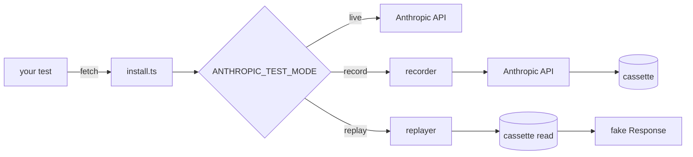

# ai-app-integration-tests
> End-to-end test patterns for LLM features in Next.js: deterministic API replay, Playwright streaming tests, flake-reduction, sub-5-minute CI.


## What this is

A small TypeScript toolkit for testing AI features in Next.js apps
without flaking on the API. The first piece, shipped here, is a
**deterministic Anthropic API replay layer**: a recorder captures real
API responses to per-request cassette files; a replayer serves them
back byte-for-byte in tests. The interception happens at Node's global
`fetch`, so any caller using `@anthropic-ai/sdk` (or raw `fetch` to
`api.anthropic.com`) is captured without touching application code.

The toolkit is opinionated about three things. First, **redaction is
mandatory and runs before write** — the recorder refuses to commit a
cassette that still contains anything matching an API-key or Bearer-token
shape, and a CI job re-checks every committed cassette so a future leak
fails the build. Second, **missing cassette = loud failure** — in
replay mode, the absence of a cassette throws with the request hash so
the operator knows exactly what to re-record (silent fall-through to
live is forbidden). Third, **mode is environment-driven** —
`ANTHROPIC_TEST_MODE` is `record | replay | live`, defaulting to
`replay` so CI never accidentally hits the real API.

Issue #1 shipped the toolkit and a demo test against a committed
Anthropic-shaped cassette. Issue #4 (this layer) ships the **example
Next.js app** that the toolkit's downstream patterns test against —
three screens (streaming, tool use, error path) under `example-app/`,
runnable with `npm run example:dev`. Playwright tests across those
screens (issue #2) layer on top.

## Architecture

See [`docs/architecture.md`](docs/architecture.md) for the full
breakdown. Quick diagram:



## Quickstart

```bash
npm install
npm run lint && npm run typecheck && npm test && npm run build
# 24 tests pass — fully hermetic, no API key needed
```

In your own test setup:

```ts
import { afterAll, beforeAll } from "vitest";
import { installFromEnv, uninstall } from "ai-app-integration-tests";

beforeAll(() => installFromEnv({ fixturesDir: "./fixtures" }));
afterAll(() => uninstall());
```

Then run your tests:

```bash
# Default: replay mode. No API key needed; missing cassette throws.
npm test

# Re-record cassettes. Real API calls. Costs real money.
ANTHROPIC_TEST_MODE=record ANTHROPIC_API_KEY=sk-... npm test

# Pass-through to the real API (no recording, no replay).
ANTHROPIC_TEST_MODE=live ANTHROPIC_API_KEY=sk-... npm test
```

### Playwright tests for streaming UI (#2)

`example-app/e2e/streaming.spec.ts` drives the example app's
`/streaming` page through three deterministic UI states using
`@playwright/test`:

1. **short stream** — prompt contains "short" → `idle → loading → first-token → done` in ≤ 1 s.
2. **long stream** — 32 chunks ~12 ms apart → `idle → loading → first-token → streaming → done`; asserted text landmarks across the stream.
3. **error stream** — prompt contains "error" → `idle → loading → error`; error card visible.

A Next.js `instrumentation.ts` hook installs a deterministic
Anthropic-API stub (`example-app/instrumentation-stub.ts`) when the
server boots with `ANTHROPIC_TEST_MODE=replay`. The stub intercepts
`globalThis.fetch` calls to `api.anthropic.com` and routes the request
to a canned SSE stream based on a keyword in the user prompt — no API
key, no network. Production behavior is unchanged when the env var is
unset.

Local run (after `npm install --prefix example-app && npx --prefix example-app playwright install chromium`):

```bash
npm run test:e2e --prefix example-app
# 3 passed in ~5 s
```

The `playwright` CI job caches the Chromium download keyed on the
Playwright package version, so post-cache runs are dominated by the
Next.js build, not the browser install.

## Benchmarks / Results

The relevant metric for this layer is "tests stay green and fast" —
24 vitest tests run in ~325 ms locally with zero network access; the
3 Playwright streaming tests run in ~5 s (CI target: <60 s per the
issue acceptance criteria, comfortably met).

## Demo

`test/demo.test.ts` exercises the full install→fetch→replay flow against
a committed Anthropic `/v1/messages` cassette. 60-second video demo
pending the example app (#4).

## Why these decisions

See [`MEMORY/core_decisions_human.md`](MEMORY/core_decisions_human.md). Notable:

- **D-002.** Fetch monkey-patch, not MSW. One provider, ~300 lines is
  cheaper than the MSW dep + worker-vs-node split.
- **D-003.** Cassette key = stable hash over `{method, url, normalized-body}`.
  Headers excluded (vary across runs).
- **D-004.** Redaction is mandatory and runs before write. CI also
  rescans every committed cassette.
- **D-005.** Missing cassette in replay mode throws. Silent fall-through
  to live is forbidden — it hides credential leaks and stale tests.

## License

MIT
