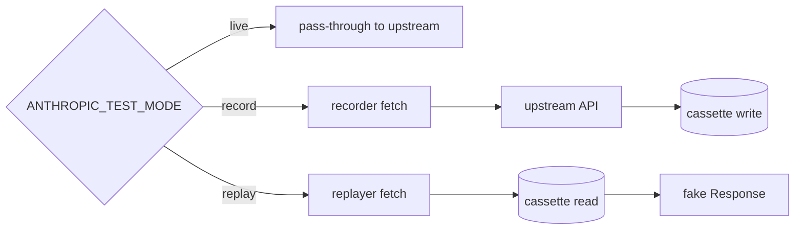

# Architecture

The toolkit is a small TypeScript package that intercepts Node's global
`fetch` and routes calls to a recorder (writes cassette to disk) or a
replayer (reads cassette from disk). One package, one interception
point — no per-test plumbing, no MSW worker bootstrap.

```
ai-app-integration-tests/
├── src/
│   ├── cassette.ts          ← schema, normalization, hashing, redaction
│   ├── io.ts                ← CassetteStore (read/write JSON files)
│   ├── fetch-recorder.ts    ← wraps fetch: recorder + replayer
│   ├── install.ts           ← installFromEnv() + uninstall()
│   └── index.ts             ← public exports
├── test/
│   ├── cassette.test.ts     ← unit tests on hashing + redaction
│   ├── record-replay.test.ts← end-to-end record→replay round-trip
│   └── demo.test.ts         ← runs against a committed Anthropic-shaped fixture
└── fixtures/
    └── <hash>.json          ← one file per recorded request
```

## Three modes



- **live** — `installFromEnv()` does nothing; tests hit the real API.
- **record** — recorder wraps `globalThis.fetch`. On every intercepted
  call it (a) re-issues the request to upstream, (b) captures the
  response (including SSE frames byte-for-byte), (c) redacts headers
  + scans for unredacted secrets, (d) writes
  `fixtures/<request-hash>.json`. The original caller sees the live
  response.
- **replay** — replayer wraps `globalThis.fetch`. On every intercepted
  call it computes the same request hash, reads the cassette, and
  rebuilds a `Response` (or a `Response` with a `ReadableStream` for
  SSE). Missing cassette throws `MissingCassetteError`.

Default mode is **replay** so CI never accidentally hits the live API.

## Request hashing (D-003)

The hash is `sha256(JSON.stringify({ method, url, body }))[:32]`, where:
- `url` has its query parameters sorted (so `?a=1&b=2` and `?b=2&a=1`
  hash equal).
- `body` is `canonicalize(parse(rawBody))` — JSON parsed, then keys
  sorted recursively. Arrays preserve order (sequence matters in
  `messages`).
- Headers are intentionally NOT in the hash. Header values vary across
  runs (timestamps, request IDs, key rotation) and would defeat
  cassette reuse.

This means two semantically-equivalent requests reuse the same cassette
even when the JSON shape differs in encoding (`{a:1,b:2}` vs `{b:2,a:1}`).

## Redaction (D-004)

Two checks run before any cassette is written:

1. **Header allowlist scrub.** `redactHeaders()` lower-cases every header
   name and replaces values for a denylist (`x-api-key`, `authorization`,
   `anthropic-api-key`, `openai-api-key`, `cookie`, etc.) with the
   string `[REDACTED]`.
2. **Body scan.** `assertNoLeakedSecrets()` serializes the entire
   cassette and rejects on three regexes: `sk-...`, `sk-ant-...`, and
   `Bearer <token>`. The check is intentionally broad — false positives
   are recoverable (rename the variable in your test); false negatives
   commit a credential to git.

The CI job `no-leaked-secrets` re-runs the body scan against every
committed cassette so a new leak in any future cassette fails the build.

## Missing cassette = loud failure (D-005)

In replay mode, a missing cassette throws `MissingCassetteError` with
the request hash and URL in the message. This is deliberate — the
alternative (silent fall-through to live) is worse:
- It hides test changes (someone tweaked a prompt; the cassette is
  stale; tests now hit the API and run a different assertion).
- It hides credential leaks (CI suddenly needs `ANTHROPIC_API_KEY`
  and the operator notices only when billing rises).

Loud failure means a test author who changes a prompt sees the test
fail with the new request hash and re-records:

```
ANTHROPIC_TEST_MODE=record ANTHROPIC_API_KEY=sk-... npm test -- demo
git add fixtures/<new-hash>.json
git rm fixtures/<old-hash>.json
```

## Why fetch-monkey-patch instead of MSW (D-002)

MSW is the canonical Node HTTP-interception library and is great when
you have multiple providers or arbitrary HTTP shapes. This repo
intercepts exactly one provider's API surface (Anthropic) and the
required behavior is small: hash, write, look up, replay, with SSE
support. Owning ~300 lines of fetch wrapper is cheaper than carrying
the MSW dep and the worker-vs-node split.

If a second provider lands, swapping to MSW is a one-file change inside
`fetch-recorder.ts` — the public API (`installRecorder` /
`installReplayer` / `installFromEnv` / `uninstall`) doesn't change.

## What this layer is NOT

- Not a Playwright test runner. Playwright tests on streaming UI states
  are issue **#2** and run *on top of* this layer (intercept the SDK
  calls inside the example app via this same install function).
- Not the example app under test. That's issue **#4**.
- Not a flake-reduction library. Test stability is a downstream
  concern — this layer makes the API call deterministic, but
  `await page.waitForSelector(...)` policies live in #2.
