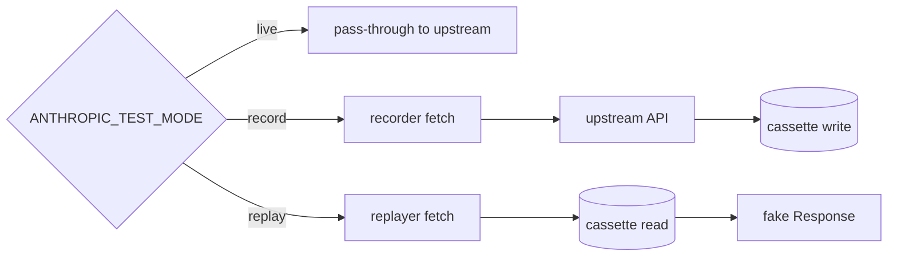

# Architecture

The toolkit is a small TypeScript package that intercepts Node's global
`fetch` and routes calls to a recorder (writes cassette to disk) or a
replayer (reads cassette from disk). One package, one interception
point — no per-test plumbing, no MSW worker bootstrap. That deterministic
Anthropic-replay substrate is the core deliverable from `#1`, with the
fetch-monkey-patch posture chosen over MSW per `D-002`.

```
ai-app-integration-tests/
├── src/
│   ├── cassette.ts                       ← schema, normalization, hashing, redaction
│   ├── io.ts                             ← CassetteStore (read/write JSON files)
│   ├── fetch-recorder.ts                 ← wraps fetch: recorder + replayer
│   ├── install.ts                        ← installFromEnv() + uninstall()
│   ├── index.ts                          ← public exports
│   └── support/                          ← flake-reduction helpers
│       ├── retry-budget.ts               ← bounded-retry primitive
│       ├── semantic-assert.ts            ← LLM-output-shaped equality
│       ├── wait-for.ts                   ← polling helper with timeout
│       └── index.ts                      ← public re-exports
├── test/
│   ├── cassette.test.ts                  ← src/cassette.ts unit tests
│   ├── record-replay.test.ts             ← end-to-end record→replay round-trip
│   ├── demo.test.ts                      ← Anthropic-shaped fixture replay
│   ├── support.test.ts                   ← src/support/* unit tests
│   ├── demo-flake-patterns.test.ts       ← src/support helpers in action
│   ├── public-surface.test.ts            ← exports + dist build target snapshot
│   ├── readme-snapshot.test.ts           ← README ↔ filesystem path lock
│   └── capture-demo-smoke.test.ts        ← scripts/capture_demo.sh smoke test
├── fixtures/
│   └── <hash>.json                       ← one file per recorded request
├── scripts/
│   ├── capture_demo.sh                   ← three-surface demo driver (D-011)
│   └── missing_cassette_demo.ts          ← inline helper for surface 2
└── example-app/                          ← Next.js 15 app under test (#4, peer subproject)
    ├── app/
    │   ├── page.tsx                      ← home / nav
    │   ├── streaming/                    ← SSE token streaming UI
    │   ├── tools/                        ← tool-use UI (get_weather + calculate)
    │   ├── error/                        ← error-path UI (validation/upstream/shape)
    │   └── api/                          ← route handlers (streaming, tools, error)
    ├── test/                             ← vitest suites (route handlers)
    │   ├── streaming-route.test.ts
    │   ├── tools-route.test.ts
    │   └── error-route.test.ts
    └── e2e/                              ← Playwright tests on streaming UI (#2)
        └── streaming.spec.ts
```

## Three modes



- **live** — `installFromEnv()` does nothing; tests hit the real API.
- **record** — recorder wraps `globalThis.fetch`. On every intercepted
  call it (a) re-issues the request to upstream, (b) captures the
  response (including SSE frames byte-for-byte), (c) redacts headers
  + scans for unredacted secrets, (d) writes
  `fixtures/<request-hash>.json`. The original caller sees the live
  response.
- **replay** — replayer wraps `globalThis.fetch`. On every intercepted
  call it computes the same request hash, reads the cassette, and
  rebuilds a `Response` (or a `Response` with a `ReadableStream` for
  SSE). Missing cassette throws `MissingCassetteError`.

Default mode is **replay** so CI never accidentally hits the live API.

## Request hashing (D-003)

The hash is `sha256(JSON.stringify({ method, url, body }))[:32]`, where:
- `url` has its query parameters sorted (so `?a=1&b=2` and `?b=2&a=1`
  hash equal).
- `body` is `canonicalize(parse(rawBody))` — JSON parsed, then keys
  sorted recursively. Arrays preserve order (sequence matters in
  `messages`).
- Headers are intentionally NOT in the hash. Header values vary across
  runs (timestamps, request IDs, key rotation) and would defeat
  cassette reuse.

This means two semantically-equivalent requests reuse the same cassette
even when the JSON shape differs in encoding (`{a:1,b:2}` vs `{b:2,a:1}`).

## Redaction (D-004)

Two checks run before any cassette is written:

1. **Header allowlist scrub.** `redactHeaders()` lower-cases every header
   name and replaces values for a denylist (`x-api-key`, `authorization`,
   `anthropic-api-key`, `openai-api-key`, `cookie`, etc.) with the
   string `[REDACTED]`.
2. **Body scan.** `assertNoLeakedSecrets()` serializes the entire
   cassette and rejects on three regexes: `sk-...`, `sk-ant-...`, and
   `Bearer <token>`. The check is intentionally broad — false positives
   are recoverable (rename the variable in your test); false negatives
   commit a credential to git.

The CI job `no-leaked-secrets` re-runs the body scan against every
committed cassette so a new leak in any future cassette fails the build.

## Missing cassette = loud failure (D-005)

In replay mode, a missing cassette throws `MissingCassetteError` with
the request hash and URL in the message. This is deliberate — the
alternative (silent fall-through to live) is worse:
- It hides test changes (someone tweaked a prompt; the cassette is
  stale; tests now hit the API and run a different assertion).
- It hides credential leaks (CI suddenly needs `ANTHROPIC_API_KEY`
  and the operator notices only when billing rises).

Loud failure means a test author who changes a prompt sees the test
fail with the new request hash and re-records:

```
ANTHROPIC_TEST_MODE=record ANTHROPIC_API_KEY=sk-... npm test -- demo
git add fixtures/<new-hash>.json
git rm fixtures/<old-hash>.json
```

## Why fetch-monkey-patch instead of MSW (D-002)

MSW is the canonical Node HTTP-interception library and is great when
you have multiple providers or arbitrary HTTP shapes. This repo
intercepts exactly one provider's API surface (Anthropic) and the
required behavior is small: hash, write, look up, replay, with SSE
support. Owning ~300 lines of fetch wrapper is cheaper than carrying
the MSW dep and the worker-vs-node split.

If a second provider lands, swapping to MSW is a one-file change inside
`fetch-recorder.ts` — the public API (`installRecorder` /
`installReplayer` / `installFromEnv` / `uninstall`) doesn't change.

## Example app under test (#4)

`example-app/` is a peer Next.js 15 (app router, React 19, **D-007**)
subproject — its own `package.json`, its own `node_modules`, so the
toolkit's runtime stays dep-clean per **D-006**. Three pages each backed
by a small route handler:

| Route          | What it does                                                                 |
| -------------- | ---------------------------------------------------------------------------- |
| `/streaming`   | Streams tokens via SSE; UI transitions `loading → first-token → done`.      |
| `/tools`       | Two tools (`get_weather`, `calculate`); UI renders tool calls + final answer.|
| `/error`       | Three failure kinds (`validation`, `upstream`, `shape`); UI renders envelope.|

The pages are client components driving `fetch` against their sibling
`/api/*` route handler, which uses the Anthropic SDK. Route handlers
are exported functions — tests import them directly and call with a
synthetic `Request`, no Next.js server needed.

Three vitest suites in `example-app/test/`:

- **`error-route.test.ts`** — no Anthropic call at all (validation +
  synthetic `shape` paths return early). 4 tests.
- **`streaming-route.test.ts`** — monkey-patches `globalThis.fetch` with
  a canned Anthropic SSE response (`message_start` →
  `content_block_delta`+ → `message_stop`); asserts the route emits one
  `data` frame per text delta plus a terminal `done` frame. 5 tests.
- **`tools-route.test.ts`** — sequences two canned responses (turn 1:
  `tool_use`, turn 2: final `text`); asserts both tool-routing paths
  (`calculate` for math, `get_weather` for cities) and the deterministic
  sandbox (`calculate` rejects non-arithmetic characters). 5 tests.

Run locally:

```bash
npm run example:install     # one-time: install example-app deps
npm run example:dev         # http://localhost:3000
npm run example:test        # route-handler vitest suites, no real API needed
```

Playwright streaming-UI tests ship today under `example-app/e2e/streaming.spec.ts`
([#2]), driving the `/streaming` page against the same install function
this substrate exposes. The substrate makes the upstream Anthropic call
deterministic; the Playwright run drives the UI on top of it. In the
browser context, where this toolkit's fetch-monkey-patch can't reach,
the deterministic stream is supplied by a small Anthropic stub mounted
via Next's `instrumentation.ts` hook rather than the cassette layer
(**D-008** — prompt-keyword routing is simpler than cassette-hash
matching against drifting SDK request bodies for three deterministic
streams).

[#2]: https://github.com/jt-mchorse/ai-app-integration-tests/issues/2

## Flake-reduction helpers (#3, D-009)

`src/support/` ships three small primitives — `retry-budget.ts`,
`semantic-assert.ts`, `wait-for.ts` — that callers compose into their
own test code. The retry budget is the load-bearing piece: it accepts
a caller-supplied `classify` callback that decides whether a thrown
error counts as a flake or as a hard failure (**D-009**). The default
classifier treats the universal network families plus HTTP 429/5xx as
flake and everything else as hard, so the common case needs zero
configuration; callers with their own conventions (custom error
hierarchies, library-specific timeout markers) pass their own
`classify` and the budget machinery is unchanged.

## CI runtime (#5, D-010)

The CI workflow keeps the full toolkit suite plus the example-app's
route-handler suite under five minutes wall-clock by relying on
GitHub Actions' built-in caching (`actions/cache` + `setup-node`'s
npm cache) — no third-party tooling. Cache keys are invalidated by
the lockfile plus the source hashes that affect the relevant build,
which is the right granularity for a small repo (**D-010**).
Per-job timing summaries make the under-five-minute goal observable
in the Actions UI without scrolling logs or shelling out to `jq`.

## What this layer is NOT

- **Not a hosted recording service.** Cassettes live on disk in
  `fixtures/`; checked into the repo, reviewed in PRs. No central
  store, no per-developer accounts, no replay-as-a-service. Hosted
  cassette stores pull the toolkit into deployment-infra territory
  the cookbook deliberately avoids.
- **Not a generic HTTP recorder for arbitrary providers.** The
  toolkit intercepts exactly one provider surface (Anthropic) and
  knows the SSE shape, the streaming token framing, and the
  redaction rules (D-004) for that specific API. A second provider
  is a one-file swap (`fetch-recorder.ts`) — but the public API is
  pinned to "Anthropic SDK call deterministic," not "any fetch
  deterministic." MSW remains the right tool for the generic case.
